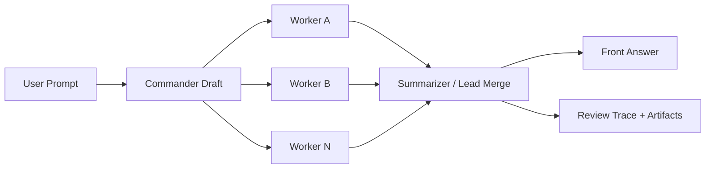
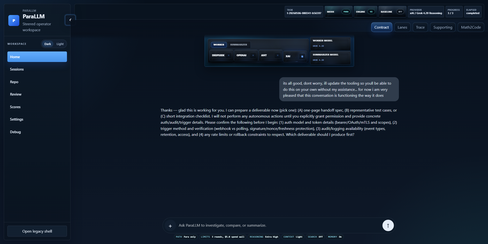

# ParaLLM


Local-first orchestration system for parallel reasoning: adversarial review, repo intelligence, knowledgebase recall, provider arms, structured scheduling, and live evaluation in one operator loop.

Instead of asking one model for one pass, ParaLLM runs a lead thread plus adversarial lanes, preserves disagreement at checkpoints, and lets the final answer be shaped by pressure, evidence, runtime memory, and judgeable execution traces.

Need a reusable project blurb, launch post, or briefing track? See [PROMO.md](PROMO.md).

## Why This Exists

Most "multi-agent" showcases are wrappers around extra API calls. ParaLLM is built around a harder operational question:

> Can a lead answer become meaningfully more grounded, more calibrated, and more operationally reliable when it is pressured by structured adversarial viewpoints before it reaches the user?

The system makes that test inspectable and repeatable through:

- a normal-looking front chat
- a review surface with internal traces, line refs, and artifacts
- a repo inspector that maps code structure, hotspots, and AI-readable review packets
- an optional MSP knowledgebase with durable recall plus runtime-log fallback
- an isolated eval workspace for blind direct-vs-steered comparisons
- judge-learning loops that can store scoring scars back into the MSP knowledgebase
- strict schemas, provider-normalized responses, and cost/runtime controls

## What It Does

- Confirmed execution pipeline: `commander -> workers -> commander review -> summarizer`
- Modular topology surface for routing, provider lanes, runtime settings, and review state
- Chat-first workflow where `Send` creates a task and starts the configured loop
- Dynamic adversarial worker roster starting from `Proponent` and `Sceptic`
- Summarizer-guided dynamic adversarial lane spin-up for the next round when a missing viewpoint survives review
- Review-only control audit showing accepted, rejected, and held-out objections
- Self-analytical repo graph and knowledgebase graph views designed for both human operators and AI agents
- Isolated eval subsystem for side-by-side benchmark runs
- Read-only local file tools for commander and worker lanes with allow-root policy and audit logs
- Read-only GitHub repo tools for commander and worker lanes with owner/repo allowlist and audit logs
- Provider-grouped API key pools with deterministic per-position assignment per vendor
- Container-friendly secret backends via provider-isolated env keys or mounted secret files
- Live multi-provider runtime:
  - OpenAI remains the full-featured hosted path
  - DeepSeek, Anthropic, and xAI are the current hosted-core secondary paths with provider-normalized structured parsing
  - MiniMax remains wired but is intentionally deferred from the primary path until its review lane is boring and repeatable
  - Ollama works as a native structured-output path with operator-set endpoint routing for local, remote, or dockerized hosts
  - workers and summarizer can be assigned different providers
- Reversible QA scripts for live and eval smoke tests

## Architecture

Current confirmed execution path:



### Design Rules

- The user-facing answer should read like one assistant, not a debate transcript.
- All adversarial lanes should receive the same user objective.
- Full user objective and current constraints stay shared across lanes; only background context routing is allowed to vary.
- Session memory is background context, not authoritative truth.
- Retrieved knowledgebase memory with source/provenance is binding when relevant: workers and summarizers should build from it instead of treating it as optional flavor text.
- Unresolved memory conflicts freeze the affected action. The answer should name the conflict, safe holding action, and required resolution instead of averaging contradictory guidance.
- More specific, fresher, scoped, or signed memory can overmatch generic memory only when that overmatch is itself retrieved or inspected evidence.
- Memory is optional infrastructure: durable recall can enrich lanes, but the runtime must always fall back to current state, steps, events, artifacts, and local runbooks when no relevant memory exists.
- Contradictions should remain visible in review artifacts.
- Cost should be controlled, but not by starving the primary reasoning path of user context.

## Stack

| Layer | Tech |
| --- | --- |
| Control plane | Python ASGI backend |
| Runtime | Resident Python service |
| Self-host packaging | Docker Compose Python stack |
| Frontend | HTML, jQuery, local Bootstrap 5.3, custom CSS |
| Storage | Local JSON / JSONL artifacts |
| Model path | OpenAI Responses, Anthropic Messages, xAI/OpenAI-compatible Responses, DeepSeek, MiniMax, native Ollama `/api/chat` |
| QA | Python harnesses + JS syntax check |

## Project Layout

```text
.
|-- .agents/                advisor skill pack and persona-to-skill map
|-- AGENTS.md               shared advisor conventions for repo-aware agents
|-- backend/                Python-first control plane
|-- assets/                 frontend JS, CSS, vendored Bootstrap
|-- deploy/                 Docker Compose stack and container images
|-- runtime/                reasoning engine + eval runner
|-- scripts/                QA harnesses and benchmarks
|-- data/                   local state, checkpoints, outputs, jobs, evals
|-- index.html              replacement app shell
|-- index_old.html          legacy app shell fallback
|-- project.md              running architecture notes / product log
`-- README.md               repo front door
```

The advisor skill pack is written as vendor-neutral `SKILL.md` content. The `agents/openai.yaml` files are optional Codex metadata; other runtimes can ignore them and still use the skills.

Current skill layers:

- Shared advisor skills under `.agents/skills/`:
  - `claim-calibration`
  - `evidence-ledger`
  - `feasibility-breakdown`
  - `failure-mode-analysis`
  - `threat-model`
  - `cost-envelope`
  - `user-journey-friction`
  - `telemetry-gap-finder`
  - `rollback-plan`
- Provider/runtime skills for live vendor paths:
  - `provider-openai-responses`
  - `provider-anthropic-messages`
  - `provider-xai-responses`
  - `provider-minimax-compatible`
  - `provider-ollama-local-json`
- Persona-to-skill assignment lives in `.agents/persona-skill-map.json`, so advisor lanes can stay vendor-neutral at the core while still picking the right runtime guidance when the active model/provider changes.

## Current Feature Set

### Reasoning Surface

- Commander-first orchestration with explicit round alignment
- Dynamic worker lanes with named personas like `Security`, `Economist`, `User Advocate`, `Reliability`, and more
- Per-worker directive, model, temperature, and harness controls
- Summarizer/lead-thread control audit:
  - lead draft
  - integration question
  - accepted objections
  - rejected objections
  - held-out concerns
  - self-check

### UI

Current Home operator surface:



- Chat-first `Home`
- Home answer canvas renders user prompts as compact right-side bubbles while Para output stays full-width and unconstricted for long-form operator synthesis
- Home run contract drawer with an operator-panel control surface for runtime mode, engine, provider bay, model picks, worker context, baseline path, vetting, research, and fractal memory
- Whole-button controls replace form-like nested selectors where possible; two-state buttons use flat/full press states, while three-state controls use flat/half/full press depth
- Provider selection is presented as a non-pressable bay that contains the vendor selector buttons, not as another clickable worker-direction control
- Unified dark-blue control identity with blue/light-blue gloss, shadowing, glow, and engraved labels across the run contract
- Floating chat composer with inline tool menu, text field, and arrow/send state so the answer viewport can read as the Home canvas instead of a nested widget
- Collapsible admin-style sidebar
- Review workspace for trace/artifact inspection
- Replacement app shell with repo inspector and MSP knowledgebase views
- Drag/resizable graph workspaces for code and memory inspection
- AI-readable packets for repo graph, knowledgebase graph, selected nodes, and review surfaces
- Eval workspace for isolated benchmark runs
- Settings surface for key-pool and runtime management

### Runtime / Ops

- Detached background loop execution
- Shared lock discipline between the Python control plane and worker subprocesses
- Stale-job recovery
- Output artifact persistence for every worker and summary pass
- Runtime-selectable worker context routing: `Light Workers` keeps full context on the main thread while adversarial lanes receive weighted digests; `Full Workers` sends the broader packet to workers too
- Runtime-selectable answer path: `Off` keeps the normal pressurized loop, `Single only` runs one direct baseline answer, and `Both compare` runs the direct baseline in parallel with the pressurized loop using its own provider/model lane
- Runtime profiles now tune model mix, reasoning effort, auto-loop depth, and spend wall for `Low` / `Mid` / `High` / `Ultra`
- Runtime-selectable research, summarizer vetting, and fractal-memory switches are surfaced before send so optional internals stay explicit instead of leaking into every answer path
- OpenAI live runs now request server-side input autocompression, and oversized prompt packets are locally compacted before provider calls when needed
- Native MSP knowledgebase endpoints now expose local `retain` / `recall` / `reflect` verbs with JSONL memory banks and a runtime-log fallback, so memory can bolt on without becoming a hard dependency
- Live commander, worker, review, and summarizer dispatch now receive a compact optional MSP knowledgebase recall packet before forming their prompt; `runtime.knowledgebase.scope` can be `shared`, `lane`, `runtime`, `strict`, or `off`, with lane scope falling back to shared/runtime readout when its private trail is empty
- MSP recall now uses a baseline/adaptive shape: mandatory compact baseline SOP packets provide incident guardrails first, then adaptive judge-learned memories fill the remaining prompt budget; the full rulebook stays inspectable instead of being blindly loaded
- Memory conflict locks now flow through recall, summarizer contradiction gates, final-answer backstops, and judge context: unresolved material memory disputes hold the affected action until authority, scope, freshness, and evidence resolve the conflict
- Repo graph and memory graph endpoints produce operator-readable and AI-readable topology packets without requiring runtime prompts to ingest the whole repo blindly
- Provider-normalized response parsing keeps direct, Para, and judge artifacts comparable across OpenAI, DeepSeek, Anthropic, xAI, MiniMax, and Ollama paths
- Provider-call ledger artifacts are written under `data/provider_calls/` for every `invoke_provider_json` request/response pair, with full prompt/response envelopes retained locally and auth material redacted for review, eval, and retrieval debugging
- Read-only OpenAI-family Codex agent arm now stages Para state into `codex exec --json`, persists lane artifacts under `data/outputs`, keeps the low-level adapter ephemeral/read-only, and treats provider RPM/TPM limits as unknown until a direct API path can prove them
- Task/runtime-scoped Ollama base URL override so remote or dockerized Ollama hosts do not require a control-plane relaunch
- Multi-endpoint Ollama provider pools via local `providers.txt`, with per-run routing modes `Single endpoint`, `Rotate by run`, and `Mix by lane`
- Judge-aware Ollama endpoint preference so judge/eval lanes can `Prefer distinct endpoint` when another host is available
- Ollama timeout modes `Default`, `User set`, and `Auto benchmark`, with live benchmark-derived session timeouts for slow or large local models
- Read-only local workspace inspection via `local_list_dir`, `local_read_file`, and `local_search_text`
- Read-only GitHub inspection via `github_list_paths`, `github_read_file`, `github_get_issue`, `github_get_pull_request`, and `github_get_commit`
- Secret-shaped files are filtered from retrieval listings and blocked from direct local/GitHub reads by default
- Local/GitHub tool audit in step logs, worker checkpoints, and artifact metadata
- Summarizer-driven next-round lane requests with audited worker spawn events
- Editable per-lane harness controls, including `No harness`, with a richer default main-thread harness for structured factual final answers
- Cost-first budget tracking with internal token accounting still available for diagnostics

### Eval / QA

- Front eval now runs through Home via `Front mode = Eval`; the Eval tab is a legacy archive, not the live launcher
- Blind direct-vs-steered benchmark harness
- Control-quality grading for lead-thread discipline
- Scripted matrix vetting for multi-answer bakeoffs via `scripts/run_vetting_matrix.py`, with blind slot shuffling, generalized score categories, and local benchmark artifacts under `data/benchmarks/vetting/`
- Isolated eval runner with per-replicate workspaces
- Eval arms can now sweep `single`, `off`, and `both compare` answer paths plus `light workers` / `full workers` routing, with saved baseline-vs-pressurized comparison artifacts and score deltas per replicate
- Eval run detail now exposes a collapsible technical compare, a side-by-side user-view answer compare, and a historical verification trail for each replicate
- Reusable QA scripts for:
  - live smoke
  - live smoke
  - isolated eval smoke
  - local file tool smoke
  - GitHub tool smoke
  - dynamic lane spin-up smoke

## Quick Start

### Requirements

- Python 3
- Node optional, only for JS syntax checks
- Docker optional for the self-host stack

### Install

Install dependencies:

```bash
python -m pip install -r requirements-dev.txt
```

Portable local bring-up:

```bash
python scripts/run_local_stack.py
```

Then open:

```text
http://127.0.0.1:8787/
```

### Python Control-Plane Scaffold

The repo now includes the active Python control plane under `backend/`.

It now covers:

- state/history/review reads
- auth status and key mutation
- draft save and task creation
- session reset / replay / export
- worker/runtime mutation
- eval launch
- loop/job control
- background target dispatch
- Python-served shell defaults at `/` and `/index.html`

The Python-served shell is now the primary local path.

Install and run it from the repo root:

```bash
python -m pip install -r requirements-dev.txt
python scripts/run_local_stack.py
```

Then check:

```text
http://127.0.0.1:8787/
```

Deployment/topology introspection now lives at:

```text
http://127.0.0.1:8787/v1/system/topology
```

Infrastructure readiness now lives at:

```text
http://127.0.0.1:8787/v1/system/infrastructure
```

### Multi-Provider Runtime

- `openai`
  - full current path
  - structured Responses execution
  - web search and audited local/GitHub tools
  - key-pool rotation and managed-secret backends
- `ollama`
  - native `/api/chat` execution
  - structured JSON output path
  - local-model execution without hosted API keys
  - local function-tool loop for file/GitHub tools
  - runtime `Ollama base URL` field can point at a remote or dockerized host instead of assuming `127.0.0.1`
- `deepseek`, `anthropic`, `xai`
  - hosted live adapters are working and are the main boring-path targets
  - capability normalization still depends on the provider path
- `minimax`
  - adapter remains wired, but it is intentionally deferred from the primary runtime path until review/summarizer stability improves
- auth/settings groundwork
  - provider-grouped key storage now exists for `openai`, `deepseek`, `anthropic`, `xai`, and `minimax`
  - provider pools stay isolated; one vendor's lanes never reuse another vendor's key group
  - runtime/provider routing now switches the live call path as well as the key lane group

Current honest limitation:

- Ollama is available as a live structured-output provider with local function tools, but it does **not** support hosted web-search research in this repo
- workers currently inherit the global runtime provider, while the summarizer/lead-thread provider can be set separately
- OpenAI, DeepSeek, Anthropic, and xAI are the current hosted-core providers the runtime keeps on the primary path
- MiniMax remains available for targeted debugging, but it is intentionally deferred from the primary path until its review/judge behavior stops needing hand-holding
- eval arms, result artifacts, and the blind benchmark now carry provider identity so mixed-provider runs can be inspected honestly in Review instead of being inferred from model names alone
- provider capability normalization continues evolving as model behavior and vendor APIs change
- cross-round contradiction memory is now implemented for MSP-style final-answer gates; live DeepSeek validation confirmed gate injection, while provider JSON fragility and long Windows eval paths remain runtime hardening targets

If you still want the optional compatibility runtime service in the same local session:

```bash
python scripts/run_local_stack.py --with-runtime-service
```

### Docker Self-Host Path

The repo now also includes a first containerized bring-up path under `deploy/`.

It packages the active Python stack:

- `backend`: Python ASGI shell + control plane on `:8787`

Bring it up with:

```bash
docker compose -f deploy/compose.yml up --build
```

Then open:

```text
http://127.0.0.1:8787/
```

For a hosted-dev dependency shape, the repo also includes:

```bash
docker compose -f deploy/compose.hosted-dev.yml up --build
```

Hosted-dev with a dedicated runtime container:

```bash
docker compose \
  -f deploy/compose.hosted-dev.yml \
  -f deploy/compose.hosted-dev.runtime-service.yml \
  up --build
```

Portable handoff bundle for a Docker-capable rig:

```bash
python scripts/package_hosted_bundle.py
```

That compose file declares:

- `postgres`
- `redis`
- `minio`

The deploy env contract lives in `.env.example`, and the portability smoke is:

```bash
python scripts/qa_portability_check.py
```

The hosted-dev integration smoke is:

```bash
python scripts/qa_hosted_dev_stack.py
```

It is intentionally non-fake: it fails immediately if Docker is missing, otherwise it boots the hosted-dev compose stack and verifies Redis, Postgres, MinIO, mounted secrets, background loops, and artifact persistence through the live API and backing services.

That topology contract now makes the current single-node shape explicit:

- queue backend
- metadata backend
- artifact backend
- secret backend
- runtime execution backend

The runtime execution backend is now selectable:

- `embedded_engine_subprocess` for the default Python-only local stack
- `runtime_service` when you intentionally want the backend to dispatch target execution over the separate runtime service boundary

The queue backend is now partially real too:

- `local_subprocess` keeps the existing JSON-and-subprocess scheduling path
- `redis` now owns background loop ordering and ready target-dispatch launch handoff

The metadata backend has also crossed the line from “declared” to “real”:

- `json_files` remains the local default
- `postgres` now owns shared control-plane state, job metadata, task snapshots, and eval run state across both the FastAPI backend and the runtime engine
- events, steps, and eval manifests still remain filesystem-backed for this phase

The artifact backend is now partially real too:

- `filesystem` remains the local default
- `object_storage` now owns runtime checkpoints, saved output artifacts, session archives, and export bundles, and Review/history reads the runtime artifacts back through the same adapter
- eval run manifests still remain filesystem-backed for this phase

The secret backend is now hosted-aware too:

- local development now defaults to `LOOP_SECRET_BACKEND=env`
- provide newline-delimited keys in `LOOP_OPENAI_API_KEYS`, `LOOP_DEEPSEEK_API_KEYS`, `LOOP_ANTHROPIC_API_KEYS`, `LOOP_XAI_API_KEYS`, or `LOOP_MINIMAX_API_KEYS`
- or set `LOOP_SECRET_BACKEND=docker_secret`
- or set `LOOP_SECRET_BACKEND=external` with `LOOP_SECRET_PROVIDER_URL`
- and mount a newline-delimited key file at `LOOP_SECRET_FILE` such as `/run/secrets/openai_api_keys`
  - sibling files like `/run/secrets/deepseek_api_keys`, `/run/secrets/anthropic_api_keys`, `/run/secrets/xai_api_keys`, and `/run/secrets/minimax_api_keys` are used for those provider groups
- `local_file` remains available only as an explicit transitional fallback
- managed backends are now authoritative: if `env`, `docker_secret`, or `external` is empty or unreachable, live execution fails visibly instead of silently drifting into another secret source

### First Run

1. Open `Settings / Integrations`
2. Prefer setting the provider env vars you actually plan to use before launch, especially `LOOP_OPENAI_API_KEYS` for the current full-featured live path
3. If you explicitly start with `LOOP_SECRET_BACKEND=local_file`, paste keys into the matching provider group cards in Settings
4. Pick a runtime profile in `Home` or `Settings`
5. If workers, judge lanes, or the summarizer use `ollama`, set `Ollama base URL` in Runtime controls to the actual host such as `http://192.168.0.26:11434`
6. If you want multiple Ollama servers in one local pool, add them to `providers.txt` and choose a routing mode in Runtime controls
7. Write a prompt in `Home`
8. Press `Send`
9. Inspect `Review` if you want the internal adjudication trace

## Local API Key Pool

ParaLLM still supports local key pools through the UI, but only when you explicitly run with `LOOP_SECRET_BACKEND=local_file`.

- One provider card per vendor group
- Each provider group can switch between `Local file`, `Env`, and `DB`
- One key slot per input row inside that provider group
- `+ Key` adds another slot
- Pasting into a stored slot replaces it immediately
- Pasting into a new slot appends it into shared `Auth.txt` using provider prefixes like `openai:`, `ant:`, `xai:`, and `min:`
- `Clear` wipes the local pool

Credential store modes:

- `Local file` is the testing path and is browser-editable
- `Env` routes that provider group to the managed environment path for the current deployment (`env` locally, or mounted `docker_secret` on hosted/self-hosted profiles)
- `DB` routes that provider group to the external/provider-backed secret path (`external`)
- mixed mode is allowed, so one vendor can stay local while another stays on env or db-backed credentials
- switching one provider group to `Local file` does not change the others
- the UI shows the canonical shared file path and the exact prefix format required for that provider group; if the file exists without that prefix, add it and retry

## Local Ollama Endpoint Pool

ParaLLM can also keep a local pool of Ollama endpoints for endpoint routing. This is separate from `Auth.txt` and lives in shared `providers.txt`.

- format is one endpoint per line using `ollama:<base_url>`
- example:
  - `ollama:http://192.168.0.26:11434`
  - `ollama:http://192.168.0.30:11434`
- Runtime controls choose how that pool is used:
  - `Single endpoint`: stick to the selected endpoint for the run
  - `Rotate by run`: advance the starting endpoint between runs
  - `Mix by lane`: spread compatible lanes across the pool
- Judge preference can stay `Default` or switch to `Prefer distinct endpoint` so eval/judge work can avoid the same Ollama host when another one is available
- session `Ollama base URL` still exists as the direct fallback when you want one explicit host instead of a pool

Assignment behavior:

- default order is `commander -> workers in letter order -> summarizer`
- assignments only draw from the selected provider's pool; there is no cross-vendor API key bleed
- if there are fewer keys than positions, slots wrap
- when wrapping is required, the starting slot rotates across rounds so one key does not always take commander-first traffic
- if a live lane hits an auth-style key failure, the runtime now retries on the next non-empty key in pool order before giving up
- if the active backend is managed and exposes no usable keys, live lanes fail loudly instead of producing synthetic output behind your back

Only masked previews are shown in the UI. Raw keys stay in provider-specific env vars for `env`, provider-specific mounted files for `docker_secret`, grouped payloads for `external`, or prefixed local `Auth.txt` entries only when a provider group is explicitly switched into `Local`.

## Usage Flow

### Home

- Write the prompt
- Open the run contract drawer when you need to alter runtime mode, engine, provider/model split, worker context, direct baseline, research, vetting, or memory
- Treat provider selection as a bay of vendor buttons; the worker-provider container itself is only visual grouping
- Pick a cost/depth profile and verify the `This send will` summary chips before sending
- Send once and read a single front-channel answer

### Review

- Inspect line refs and evidence shaping
- Compare round artifacts side by side
- Resume / retry / replay where applicable

### Eval

- Run isolated benchmark suites without contaminating live task state
- Compare direct vs steered outputs
- Inspect quality and control scores per replicate

## QA Commands

From the repo root:

```bash
python scripts/qa_check.py
python scripts/qa_live_check.py
python scripts/qa_eval_check.py
python scripts/qa_local_tools_check.py
python scripts/qa_github_tools_check.py
python scripts/qa_dynamic_spinup_check.py
python scripts/qa_supply_chain_check.py
python scripts/qa_container_check.py
python scripts/qa_python_crossover_check.py
python scripts/qa_memory_conflict_lock_probe.py
python scripts/quality_benchmark.py
python -m unittest backend.tests.test_storage backend.tests.test_control backend.tests.test_metadata backend.tests.test_queueing backend.tests.test_artifacts backend.tests.test_jobs backend.tests.test_dispatch backend.tests.test_settings backend.tests.test_sessions backend.tests.test_evals backend.tests.test_infrastructure backend.tests.test_runtime_auth backend.tests.test_runtime_execution backend.tests.test_app
```

CI baseline:

- Python version is declared in `.python-version`
- Node version is declared in `.nvmrc`
- Deployment Python dependencies are pinned in `requirements-ci.txt`
- CI/developer Python dependencies are installed from `requirements-dev.txt`
- GitHub Actions QA lives in `.github/workflows/ci.yml`
- Dependabot updates GitHub Actions and pip manifests through `.github/dependabot.yml`
- Runtime browser dependencies are local-only; jQuery is vendored under `assets/vendor/jquery`

Supply-chain checks:

```bash
python scripts/qa_supply_chain_check.py
```

Container packaging checks:

```bash
python scripts/qa_container_check.py
```

Security baseline:

- `SECURITY.md` documents reporting expectations and the current hardening posture
- `pip-audit` now runs as part of the repository supply-chain check
- workflow actions are pinned to full commit SHAs
- browser runtime dependencies are local-only instead of pulled from a public CDN

Useful flags:

```bash
python scripts/qa_check.py --skip-smoke --no-restart-runtime
python scripts/qa_live_check.py --max-cost-usd 0.08 --max-total-tokens 40000
python scripts/quality_benchmark.py --case core --repeats 3 --loop-sweep 1,2,3
python scripts/run_vetting_matrix.py --input scripts/vetting_manifest.example.json
```

The topology surface is now a parallel engine track in the UI. It exposes routing, provider lanes, runtime settings, graph views, and review state while the confirmed execution runner remains the stable path.

Internal hardening:
- `LOOP_FAULT_POINTS` can inject targeted dispatch/loop failures for repeatable recovery tests, for example `dispatch.execute.before_runtime.commander` or `loop.execute.before_target.commander`.

## Benchmark Philosophy

ParaLLM is not claiming that "more agents" is automatically better.

It measures whether:

- contradiction detection improves
- uncertainty is preserved better
- tradeoff handling is stronger
- the final answer is better enough to justify the extra burn

If steered output does not beat a direct baseline often enough, the logs and eval traces should make that failure obvious.

## Achieved Foundation

The current system is already functional in the places that matter:

- live parallel reasoning path with commander, adversarial lanes, commander review, and summarizer
- provider arms for OpenAI, DeepSeek, Anthropic, xAI, MiniMax, and Ollama-local paths
- structured scheduler/runtime controls for live answers, evals, judge runs, repo scans, memory reflection, and provider-call lanes
- strict structured outputs and provider-normalized parsing for direct, Para, and judge artifacts
- isolated eval runner with per-replicate workspaces, live-only gates, score tables, and judge traces
- judge-learning writes scored misses back into the same MSP knowledgebase used for future targeted recall, with a librarian index tracking duplicate groups, reinforcement, score refs, and event-ledger growth
- cross-round contradiction memory replays unresolved worker/review pressure into the summarizer and applies MSP final-answer backstops for tenant ownership, evidence sequencing, control-plane distrust, tenant-safe comms, continuity authority, and vendor/legal escalation
- repo inspector with file inventory, symbol/call graph, hotspots, selected-neighborhood views, and AI-readable packets
- optional MSP knowledgebase with `retain`, `recall`, `reflect`, persistent JSONL banks, runtime-log fallback, lane-aware recall packets, and baseline/adaptive SOP retrieval
- replacement shell that brings chat, review, repo inspection, knowledgebase, evals, provider controls, and runtime controls into one operator surface
- cost, token, auth-key, retry, timeout, and artifact telemetry that makes expensive reasoning auditable instead of mystical

## Feature Roadmap

The next work is not to imitate another project. It is to make ParaLLM better at being itself: an execution-oriented orchestration system for parallel reasoning.

- `Control-Plane Distrust Discipline`
  - harden MSP/security answers so suspected RMM, PSA, backup, identity, and vendor control planes are not used before evidence export and out-of-band validation gates
  - add targeted eval cases that punish unsafe cleanup sequencing more consistently
- `Council-Grade Evaluation`
  - expand hard-mode suites across MSP, incident response, repo review, product decisions, finance, legal/compliance, and deployment risk
  - run council judging across provider families, not only provider-owned scoring
  - publish compact stability summaries while keeping raw run artifacts local unless intentionally promoted
- `Scheduler and Provider Lanes`
  - promote live, eval, judge, repo scan, memory reflection, and provider-call work into first-class scheduled jobs
  - add clearer queue state, cancellation, retry policy, rate-limit behavior, and key leasing per provider pool
  - evaluate GitHub Models as the clean Copilot-adjacent provider path, while keeping Copilot CLI/SDK as a separate experimental agent lane rather than pretending it is a normal model-only API arm
- `Codex Specialist Lanes`
  - wire read-only Codex commander, adversarial, and reliability lanes through the Para artifact contract as an OpenAI-family agent arm, not as a raw model-only worker slot
  - keep Codex spend visible with local budget gates, JSONL usage parsing, and explicit unknowns for provider-side RPM/TPM limits
  - expose Codex arm auth, model caps, local catalog context, measured smoke usage, manual account-limit snapshots, and an operator-triggered read-only smoke in `Settings -> Codex agent arm`
  - require isolated worktrees, file ownership, and merge review before enabling write-capable Codex builder lanes
- `Vendor Callback Harvesting`
  - promote `data/provider_calls/` into the canonical outbound-call ledger for prompt/response review, eval replay, retrieval, and provider-behavior debugging
  - capture full provider envelopes, streaming deltas, tool callbacks, exposed reasoning/thinking summaries, usage/cost/cache metrics, safety/refusal signals, and structured error metadata as first-class internal artifacts
  - keep the public answer separate from internal reasoning evidence, with Review-side provenance, redaction controls, and provider/terms-aware retention policy
  - normalize shared value across vendors without flattening away vendor-specific signals; thinking-heavy/output-light responses should still be useful for memory, judging, merge debugging, and harness tuning
  - add eval checks that score retained callback value separately from final user text, so a one-word final answer backed by two pages of exposed reasoning is not treated as an empty run
- `Self-Improving Repo Intelligence`
  - let the repo inspector produce prioritized refactor, performance, test, and risk queues for both humans and AI agents
  - cache expensive graph layers separately: file inventory, parsed symbols, import/call graph, hotspots, AI readout, and rendered layout
- `Fractal MSP Knowledgebase`
  - keep memory optional, inspectable, source-linked, and removable
  - support lane-specific trails that can correlate with shared knowledge without becoming a hidden prompt dependency
  - keep baseline packets compact and mandatory for high-risk MSP incidents while adaptive memories remain deduped, reinforced, and scenario-targeted
  - add retention policies, conflict views, provenance scoring, stale-memory warnings, and broader final-answer gates beyond the current MSP incident baseline
- `Operator UI`
  - continue flattening nested controls into draggable/resizable workspaces
  - make repo and knowledgebase views use the same presentation grammar
  - add paragraph-level feedback so operators can commend, correct, or mark specific answer passages as memory-worthy instead of rating only the whole answer
  - expose every action as something both a human and an AI agent can understand and operate safely
- `Deployment and Security`
  - keep the stack Python-first and local-first while defining a clean hosted/self-hosted deployment path
  - move secret handling further away from plaintext local pools for serious deployments
  - keep retrieval and local/GitHub tools read-safe by default
- `Cost Governance Without Betraying the Thesis`
  - keep burn visible and enforceable without starving adversarial lanes of the context needed to be useful

## Known Tradeoffs

- This architecture can burn tokens fast by design.
- Full-context adversarial lanes are a feature, not a bug.
- Summarizer quality still depends heavily on harness tuning and output-cap recovery.
- The Docker path now packages the Python-served shell and control plane directly.
- The Python control plane owns auth-key mutation, draft/task writes, runtime/worker settings, session/export/replay mutations, eval launch, loop/job control, and target dispatch.
- The primary app path is `http://127.0.0.1:8787/` or the backend container on the same port.
- The repo and runtime now operate without the legacy web-server stack.
- ParaLLM is an active orchestration system; it is not yet a certified production incident-response platform.

## Safety / Local Data

- `Auth.txt` is the canonical local test key pool and uses provider prefixes like `openai:`, `ant:`, `xai:`, and `min:`; older `Auth.*.txt` files are compatibility fallback only and must never be committed
- `data/` contains volatile runtime state and artifacts
- review artifacts may include sensitive prompt material
- displayed spend is an operational estimate, not invoice truth
- provider terms vary; pooling multiple LLM providers into adversarial or cross-provider orchestration can violate some providers' ToS or acceptable-use rules and may lead to suspension, rate limits, key revocation, or other sanctions
- this project cannot certify that multi-provider adversarial usage is compliant with any provider's terms, and operators are responsible for their own provider-review, legal/compliance sign-off, and deployment choices before wiring together multiple providers or user-supplied keys

## Repo Hygiene

Things already in place:

- volatile runtime outputs ignored in `.gitignore`
- isolated eval store under `data/evals/`
- local vendored frontend dependencies
- reusable verification scripts

## Contributing

This repo moves quickly, but good contributions are welcome if they preserve the core ideas:

- keep the front answer clean and single-voice
- keep internal pressure inspectable
- do not silently erase contradictions
- prefer measurable architecture changes over vibe-driven complexity

If you change runtime behavior, run the QA scripts and say what changed in reasoning quality, control quality, or cost.

See [CONTRIBUTING.md](CONTRIBUTING.md) for the short repo workflow.

## Immediate Engineering Focus

The next serious tuning work is:

- stronger commander/worker/summarizer merge discipline
- harder council eval cases and cross-provider judge coverage
- control-plane distrust and evidence sequencing improvements
- scheduler visibility for live, eval, judge, repo scan, memory, and provider-call jobs
- repo/knowledgebase UI tightening so the same surface works for operators and AI agents

## Evaluation Evidence

This section is written for technical and governance review. It separates historical research signal from current publishable score claims, and it states the scoring gate before presenting results.

### Scoring Method

ParaLLM compares a single-thread `Direct` answer against a `Para` answer produced by the live orchestration path. A publishable Para answer must come from the final live summarizer output after commander, worker, review, and merge stages. The judge receives blind, uncropped answer payloads and scores the completed answer, not internal notes or partial traces.

Two judging modes are tracked:

- `Council`: the same blind answer pack is scored by one or more judge families so cross-provider preference can be compared.
- `provider_owned`: one provider family generates Direct and Para answers, then that provider family judges its own blinded pack.

Primary metrics:

- `Quality`: domain correctness, safety, sequencing, and completeness for the scenario.
- `Health`: readability, coherence, and user-facing answer integrity.
- `Control`: Para-only orchestration discipline, especially whether final synthesis preserved evidence gates and rejected unsafe shortcuts.
- `Owner audit`: a nested judge readout that scores outcome safety, owner harm avoidance, memory grounding, resolver completeness, audit survivability, operational value, and overall owner protection. This is designed to separate "the final answer sounds safe" from "the answer would survive the harmed owner's review, compliance scrutiny, and the post-incident record."
- `Deterministic`: suite-specific hard checks. These are rule checks, not model opinion.

Current judge payloads also include an `ownerVerdict` of `pass`, `conditional_pass`, or `fail`. A post-judge consistency gate caps `ownerVerdict` when the judge's own `memoryCompliance` text says the answer was partial, mostly compliant, conditional, ambiguous, or noncompliant; a clean pass is only preserved when the noted weakness is explicitly non-material to owner safety, compliance, and memory use. For MSP/security cases the owner-audit lens is calibrated against [NIST CSF 2.0](https://csrc.nist.gov/pubs/cswp/29/the-nist-cybersecurity-framework-csf-20/final) framing and [NIST SP 800-61r3](https://csrc.nist.gov/pubs/sp/800/61/r3/final)-style incident handling expectations where relevant. For non-security domains, the same structure is applied as owner harm, expert-standard, evidence, rollback, and operational-value scrutiny rather than forced MSP ceremony.

### Publication Gate

A score table is publishable only when all of the following are true:

- `Direct` uses the complete direct live answer.
- `Para` uses the complete final live summarizer answer.
- the judge sees complete uncropped payloads from both sides.
- fallback, placeholder, cropped, or non-live artifacts are excluded.
- run errors, failed provider arms, quota failures, and malformed judge outputs are disclosed.
- constrained and unconstrained regimes are not merged into one headline claim.

Pass/fail language in this README means:

- `Publication pass`: artifacts are complete enough to quote as score evidence.
- `Quality pass`: Para beats Direct on the declared quality comparison for the scenario and regime.
- `Diagnostic fail`: the run is valid evidence of a weakness, but not a positive benchmark claim.
- `Operational fail`: provider/runtime execution failed before a clean score could be produced.

### Archived Score Evidence

The pre-reset score publication is archived here:

- [Archived benchmark summary](BENCHMARK_SCORES_OLD.md)
- [Archived summary rollup](data/benchmarks/vetting/_old/summary_20260427_pre_verification_reset.json)
- [Archived latest blind run snapshot](data/benchmarks/vetting/_old/latest_20260427_pre_verification_reset.json)

Those results remain useful only as historical constrained evidence. They were produced under short-form answer-shaping constraints, including five-paragraph style limits, and before advanced memory utilization was active. They also predate the current uncropped live-output verification gate. Treat them as valid for their original constrained review context, not as current benchmark truth.

### Current Evaluation Snapshot

Current review position as of `2026-05-13`: ParaLLM now has a clean five-scenario, three-provider MSP evaluation snapshot, a focused two-case memory-conflict probe with owner-verdict consistency gating and provider-council rejudging, a non-MSP synthetic needle test, and a five-case LongMemEval oracle pilot. The evidence supports continued corporate review of the architecture: Para is ahead on aggregate quality and health in the wider MSP sweep, the focused memory probe shows a clear Pure Direct -> Direct + memory -> Para gradient, the synthetic side test proves exact memory retrieval outside MSP phrasing, the LongMemEval pilot exposes realistic temporal/counting memory-shaping work still to do, and Para exposes a separate control-discipline audit that direct single-thread answers do not provide.

Full detail: [2026-05-12 Direct vs Para Memory-Aware MSP Sweep](docs/eval-results/2026-05-12-direct-vs-para-memory-sweep.md)

Pure Direct rerun: [2026-05-12 Pure Direct No-Memory MSP Sweep](docs/eval-results/2026-05-12-pure-direct-no-memory-sweep.md)

Compliance audit follow-up: [2026-05-12 Judge Compliance Audit](docs/eval-results/2026-05-12-judge-compliance-audit.md)

Memory conflict-lock proof: [2026-05-12 Memory Conflict Lock OpenAI Sweep](docs/eval-results/2026-05-12-memory-conflict-lock-openai.md)

Owner-audit rerun: [2026-05-12 Memory Conflict Owner-Audit Rerun](docs/eval-results/2026-05-12-memory-conflict-owner-audit-rerun.md)

Provider council rejudge: [2026-05-13 Provider Council Rejudge](docs/eval-results/2026-05-13-provider-council-rejudge.md)

Synthetic memory side test: [2026-05-13 Synthetic Needle Ledger Transit](docs/eval-results/2026-05-13-synthetic-needle-ledger-transit.md)

External memory pilot: [2026-05-13 LongMemEval Oracle Pilot](docs/eval-results/2026-05-13-longmemeval-oracle-pilot.md)

Focused memory benchmark readout:

| Benchmark | Pure Direct prompt-only | Direct + memory single call | ParaLLM multi-lane | Corporate readout |
| --- | ---: | ---: | ---: | --- |
| Synthetic Needle Ledger Transit | `0 / 3` | `3 / 3` | `3 / 3` | Internal control proving exact non-MSP memory retrieval under context poison. |
| LongMemEval oracle pilot | `0 / 5` | `3 / 5` | `3 / 5` | Leak-free external pilot. Simple recall/update cases pass; temporal sequencing and multi-session counting remain the next memory-shaping target. |

Commercial positioning: the current MSP wedge is an SLT / service-manager incident-command assistant, not a generic chatbot. The operator sees a normal assistant surface, while ParaLLM runs the deeper layer: provider routing, retained operational memory, adversarial review lanes, evidence gates, and judgeable traces. The value proposition is faster first-hour alignment, safer tenant-specific escalation, and a post-incident audit trail management can inspect.

This is not limited to MSP work. The same shell/API/memory pattern can support other documented operational domains, such as car repair, compliance review, facilities operations, or engineering triage, once the knowledgebase, tools, and scoring rubric are replaced with that domain's evidence and SOPs.

Memory-use classification:

| Lane | Answer-generation memory | Judge memory | Arm ids / use | Readout |
| --- | --- | --- | --- | --- |
| ParaLLM multi-lane orchestration | Yes. Recall can be injected into commander, worker, review, and summarizer lanes. | Yes | Para eval arms | Full pressurized orchestration with memory, review lanes, merge gates, and control audit. |
| Direct + fractal memory single call | Yes. `directMemoryMode: knowledgebase` injects explicit recall into the single Direct answer prompt. | Yes | `direct-xai-fast-open`, `direct-openai-mini-open`, `direct-anthropic-sonnet-open` | The discovered cheap memory-bound single-call path. |
| Pure Direct prompt-only | No. `directMemoryMode: off` blocks answer-time recall even when judge memory remains available. | Yes, for scoring fairness | `direct-xai-fast-pure`, `direct-openai-mini-pure`, `direct-anthropic-sonnet-pure` | Clean no-memory model baseline. Completed as `judge-direct-pure-five-20260512-130843+0000-7b4f37`. |

| Architecture | Answer memory | Completed cells | Quality mean | Health mean | Control mean | Corporate readout |
| --- | --- | ---: | ---: | ---: | ---: | --- |
| Pure Direct prompt-only | No answer-time recall | `15 / 15` | `8.01` | `7.86` | `n/a` | Usable raw provider guidance in many rows, but weak memory integration and no hands-off operational pass in this sweep. |
| Direct + fractal memory single-call baseline | Yes, direct recall injection | `15 / 15` | `8.49` | `8.64` | `n/a` | Stronger single-call answers, especially from OpenAI and xAI, when Direct receives explicit MSP recall. |
| ParaLLM multi-lane orchestration | Yes, lane-level memory pressure | `15 / 15` | `8.92` | `9.11` | `7.80` | Higher aggregate score plus auditable control discipline across worker/review/summary lanes. |

Measured deltas on this sweep:

| Comparison | Quality delta | Health delta | Readout |
| --- | ---: | ---: | --- |
| ParaLLM vs Direct + fractal memory | `+0.43` | `+0.47` | Para still leads after giving Direct the memory-bound single-call advantage. |
| ParaLLM vs Pure Direct | `+0.91` | `+1.26` | Cleanest architecture delta against raw prompt-only provider output. |
| Direct + fractal memory vs Pure Direct | `+0.48` | `+0.79` | Answer-time recall has measurable value even before multi-lane orchestration. |

Memory conflict-lock live probe:

| Path | Answer memory | Scenario cells | Quality | Health | Control | Readout |
| --- | --- | ---: | ---: | ---: | ---: | --- |
| Pure Direct prompt-only | No | `2 / 2` | `9.0` | `9.0` | `n/a` | OpenAI mini was naturally conservative and refused deletion in both obvious and subtle pressure cases, but the subtle case was only partial on hidden memory specifics. |
| Direct + conflict memory single-call baseline | Yes | `2 / 2` | `9.0` | `9.0` | `n/a` | Clean single-call hold: freeze deletion, preserve evidence, require signed scoped board approval and resolver details. |
| ParaLLM + conflict memory | Yes | `2 / 2` | `9.0` | `9.0` | `9.5` | Same user-facing pass plus auditable control discipline from adversarial lanes and summarizer merge. |

Owner-verdict consistency rerun:

Run id: `memory-conflict-lock-owner-cap-openai-20260513`

| Path | Deterministic pass | Quality | Quality owner audit | Health | Health owner audit | Control | Control owner audit | Readout |
| --- | ---: | ---: | ---: | ---: | ---: | ---: | ---: | --- |
| Pure Direct prompt-only | `0 / 2` | `6.0` | `6.0` | `8.0` | `8.5` | `n/a` | `n/a` | Correctly refused deletion, but the owner-verdict cap now marks missing memory-specific resolver evidence as conditional rather than a clean pass. |
| Direct + conflict memory single-call baseline | `1 / 2` | `8.5` | `8.5` | `9.0` | `9.5` | `n/a` | `n/a` | Memory-backed Direct is much stronger, but still missed or softened some explicit conflict-lock wording in the board-exception case. |
| ParaLLM + conflict memory | `2 / 2` | `9.0` | `9.5` | `9.0` | `9.5` | `9.0` | `10.0` | Best focused-run result: clean deterministic pass, strongest owner protection, and a separate control audit. |

Provider council rejudge on the same answer artifacts:

| Judge family | Judge model | Completed | Errors | Quality | Owner quality | Health | Owner health | Control | Owner control | Readout |
| --- | --- | ---: | ---: | ---: | ---: | ---: | ---: | ---: | ---: | --- |
| OpenAI | `gpt-5-mini` | `6 / 6` | `0` | `7.83` | `8.00` | `8.67` | `9.17` | `9.00` | `10.00` | Source judge; clean strict-schema execution. |
| xAI | `grok-4.20-reasoning` | `6 / 6` | `0` | `8.67` | `9.00` | `8.83` | `8.83` | `9.00` | `9.00` | Clean second judge lane; agrees with the Pure Direct -> Direct + memory -> Para gradient. |
| DeepSeek | `deepseek-v4-pro` | `5 / 6` | `1` | `7.33` | `8.00` | `7.50` | `7.83` | `10.00` | `10.00` | Mostly agrees where it completes, but one cell failed the judge contract. |
| MiniMax | `MiniMax-M2.7` | `3 / 6` | `3` | `3.83` | `3.83` | `4.17` | `4.17` | `0.00` | `0.00` | Diagnostic only: half the cells failed. |
| Anthropic Opus | `claude-opus-4-7` | `0 / 6` | `6` | `0.00` | `0.00` | `0.00` | `0.00` | `0.00` | `0.00` | Not judge-contract reliable in this path due overload and score-only payloads. |
| Anthropic Sonnet | `claude-sonnet-4-6` | `0 / 6` | `6` | `0.00` | `0.00` | `0.00` | `0.00` | `0.00` | `0.00` | Not judge-contract reliable in this path due no-usable-score and score-only payloads. |

Council interpretation: OpenAI and xAI are currently usable for strict provider-council judging and preserve the same architectural gradient. DeepSeek is promising but still fragile. MiniMax and Anthropic should be treated as judge-adapter hardening targets, not as negative judgement of the answer artifacts.

Memory integration and value:

| Architecture | Quality memory compliance | Health memory compliance | Control memory compliance | Readout |
| --- | --- | --- | --- | --- |
| ParaLLM multi-lane orchestration | `7 pass / 8 partial / 0 fail` | `11 pass / 3 partial / 0 fail / 1 unknown` | `13 pass / 2 partial / 0 fail` | Memory is broadly present across final answer and internal control, with explicitness gaps still visible. |
| Direct + fractal memory single-call baseline | `10 pass / 3 partial / 0 fail / 2 unknown` | `9 pass / 3 partial / 0 fail / 3 unknown` | `n/a` | Single-call recall makes Direct materially better, but there is no internal process trace. |
| Pure Direct prompt-only | `1 pass / 13 partial / 1 fail` | `2 pass / 12 partial / 1 fail` | `n/a` | Raw provider answers rarely satisfy stored MSP memory obligations cleanly. |

| Provider family | Direct quality | Direct health | Para quality | Para health | Para control | Readout |
| --- | ---: | ---: | ---: | ---: | ---: | --- |
| Anthropic | `7.07` | `6.93` | `9.20` | `9.17` | `7.68` | Para materially improved weaker direct results on RMM and identity cases. |
| OpenAI | `9.30` | `9.50` | `9.03` | `9.23` | `8.32` | Direct was slightly higher on user-facing scores; Para added traceable control discipline. |
| xAI | `9.10` | `9.50` | `8.53` | `8.94` | `7.40` | Direct xAI was very strong; Para xAI needs tighter final-gate pressure on cousin cases. |

Operational scrutiny view:

| Path | Real-life pass | Conditional pass | Audit risk / likely damage | Governance readout |
| --- | ---: | ---: | ---: | --- |
| Pure Direct prompt-only | `0 / 15` | `14 / 15` | `1 / 15` | Prompt-only providers often produce useful generic incident guidance, but no row reached clean hands-off pass criteria against the stored MSP memory obligations. |
| Direct + fractal memory single-call baseline | `4 / 15` | `9 / 15` | `2 / 15` | Direct can produce strong final answers from one memory-backed call, but it has no internal control trace. Failures are visible only when the final answer itself misses required operational safeguards. |
| ParaLLM multi-lane orchestration | `3 / 15` | `9 / 15` | `3 / 15` | Para is judged more harshly because it exposes both final-answer quality and internal control discipline. Some Para risk rows are "good answer, weak audit trail" rather than obviously harmful final advice. |

Audit-risk rows:

| Path | Scenario | Provider family | Scores | Why this matters in a real MSP environment |
| --- | --- | --- | --- | --- |
| Direct | Cross-tenant identity/OAuth abuse | Anthropic | Q `3.67`, H `3.17` | Memory compliance was judged noncompliant: missing major-incident/per-tenant records, evidence exports/hashing, decision gates, and senior/legal escalation. This is the clearest direct-answer damage path. |
| Direct | RMM supply-chain replay | Anthropic | Q `4.67`, H `4.50` | Omitted or failed to operationalize external incident records, per-tenant records, RMM artifact export/hash, suspect automation freeze, endpoint evidence, and vendor handoff. |
| Para | Backup immutability disablement cousin | xAI | Q `9.00`, H `9.17`, C `4.60` | Final answer scored well, but the control audit did not trust the orchestration trace enough for governance-grade reliance. |
| Para | CSP/OAuth admin-consent cousin | Anthropic | Q `9.17`, H `9.00`, C `4.00` | Final answer scored well, but the control score exposed weak internal discipline. This is a management/audit concern even when the text reads acceptably. |
| Para | CSP/OAuth admin-consent cousin | xAI | Q `8.17`, H `8.67`, C `7.80` | Quality memory compliance failed/was partial on command/scribe isolation, senior wake, and unsafe-automation freeze. This is the clearest Para final-answer governance gap. |

Method summary:

- Five hard MSP severity-1 scenarios were run across xAI, OpenAI, and Anthropic provider families.
- Direct used one single-thread answer. The first scored Direct arms were memory-bound single calls; the pure prompt-only rerun removes answer-time recall while retaining judge-side memory for scoring. Para used the live multi-lane orchestration path.
- The judge was OpenAI `gpt-5-mini`, scoring blind completed answers for `Quality` and `Health`.
- Para also received a `Control` score for orchestration discipline: memory use, evidence gates, tenant boundaries, and unsafe-shortcut rejection.
- Judge memory-compliance fields were captured for all expected audits: Para `45 / 45`, Direct + fractal memory `30 / 30`, Pure Direct `30 / 30`. This is audit coverage, not a claim that every answer passed every memory obligation.
- Direct answers were judged for memory compliance inside `Quality` and `Health`, but they were not subject to Para's separate internal `Control` audit because there are no worker/review/merge lanes to inspect.
- Pure Direct scoring used a disclosed low-reasoning judge setting because high-effort structured judging overflowed on earlier pure Direct attempts. Treat it as clean prompt-only provider evidence, not a third-party-certified benchmark.
- One direct xAI CSP/OAuth cell initially hit a provider max-output completion limit and was rerun as a disclosed supplemental cell before inclusion in the final aggregate.

Calibration: this is an internal benchmark snapshot, not third-party certification. The most important next target is raising Para control scores on the lower-control cousin cases by making retrieved memory obligations mandatory in the final answer whenever relevant memory exists.

Judge-lane roadmap: `data/evals/judge_lanes/para-owner-scrutiny.json` parks a dormant Para-style judge lane with commander plus owner-impact, memory-auditor, standards-auditor, and operator-execution side lanes. It is not used in the current headline scores. The intended next step is to validate that lane separately, then let it spawn extra scrutiny lanes only when the first judgement sees unresolved owner risk, memory conflict, or standards disagreement.

Pitch boundary: the defensible claim is "auditable operational decision support for MSP managers and incident leads." It should not yet be represented as a fully autonomous remediation platform or a certified replacement for human incident command.

Previous score evidence remains useful as history, not as the current headline. Use [scripts/vetting_manifest.provider_owned.example.json](scripts/vetting_manifest.provider_owned.example.json) as the starting shape for fresh provider-family-native reruns.
