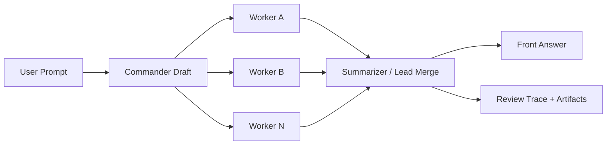

# ParaLLM


Local-first adversarial reasoning workspace for testing whether structured disagreement can improve final answers.

Instead of asking one model for one pass, ParaLLM runs a lead thread plus adversarial lanes, preserves disagreement at checkpoints, and lets the final answer be shaped by pressure rather than narrated as a debate recap.

## Why This Exists

Most "multi-agent" demos are really just wrappers around extra API calls. This project is trying to answer a harder question:

> Can a lead answer become meaningfully more grounded, more calibrated, or more robust when it is pressured by structured adversarial viewpoints before it reaches the user?

The current prototype is built to make that test inspectable:

- a normal-looking front chat
- a review surface with internal traces, line refs, and artifacts
- an isolated eval workspace for blind direct-vs-steered comparisons
- explicit cost controls, loop controls, and runtime profiles

## What It Does

- Chat-first workflow where `Send` creates a task and starts the configured loop
- Commander-first runtime evolving toward: `commander -> workers -> commander review -> summarizer`
- Dynamic adversarial worker roster starting from `Proponent` and `Sceptic`
- Summarizer-guided dynamic adversarial lane spin-up for the next round when a missing viewpoint survives review
- Review-only control audit showing accepted, rejected, and held-out objections
- Isolated eval subsystem for side-by-side benchmark runs
- Read-only local file tools for commander and worker lanes with allow-root policy and audit logs
- Read-only GitHub repo tools for commander and worker lanes with owner/repo allowlist and audit logs
- Local API key pool with deterministic per-position assignment
- Reversible QA scripts for mock, live, and eval smoke tests

## Architecture



### Design Rules

- The user-facing answer should read like one assistant, not a debate transcript.
- All adversarial lanes should receive the same user objective.
- Session memory is background context, not authoritative truth.
- Contradictions should remain visible in review artifacts.
- Cost should be controlled, but not by starving the primary reasoning path of user context.

## Stack

| Layer | Tech |
| --- | --- |
| Control plane | PHP on XAMPP |
| Runtime | Resident Python service |
| Frontend | HTML, jQuery, local Bootstrap 5.3, custom CSS |
| Storage | Local JSON / JSONL artifacts |
| Model path | OpenAI Responses API |
| QA | Python harnesses + PHP lint + JS syntax check |

## Project Layout

```text
.
|-- api/                    PHP broker endpoints
|-- assets/                 frontend JS, CSS, vendored Bootstrap
|-- runtime/                resident Python runtime + eval runner
|-- scripts/                QA harnesses and background loop runner
|-- data/                   local state, checkpoints, outputs, jobs, evals
|-- index.html              app shell
|-- project.md              running architecture notes / product log
`-- README.md               repo front door
```

## Current Feature Set

### Reasoning Surface

- Commander-first orchestration with explicit round alignment
- Dynamic worker lanes with named personas like `Security`, `Economist`, `User Advocate`, `Reliability`, and more
- Per-worker directive, model, temperature, and harness controls
- Summarizer/lead-thread control audit:
  - lead draft
  - integration question
  - accepted objections
  - rejected objections
  - held-out concerns
  - self-check

### UI

- Chat-first `Home`
- Compact runtime profile controls on the front dash
- Collapsible admin-style sidebar
- Review workspace for trace/artifact inspection
- Eval workspace for isolated benchmark runs
- Settings surface for key-pool and runtime management

### Runtime / Ops

- Detached background loop execution
- Shared lock discipline between PHP and Python
- Stale-job recovery
- Output artifact persistence for every worker and summary pass
- Read-only local workspace inspection via `local_list_dir`, `local_read_file`, and `local_search_text`
- Read-only GitHub inspection via `github_list_paths`, `github_read_file`, `github_get_issue`, `github_get_pull_request`, and `github_get_commit`
- Local/GitHub tool audit in step logs, worker checkpoints, and artifact metadata
- Summarizer-driven next-round lane requests with audited worker spawn events
- Budget, token, and estimated-spend tracking
- Requested-vs-effective output-token cap visibility

### Eval / QA

- Blind direct-vs-steered benchmark harness
- Control-quality grading for lead-thread discipline
- Isolated eval runner with per-replicate workspaces
- Reusable QA scripts for:
  - mock smoke
  - live smoke
  - isolated eval smoke
  - local file tool smoke
  - GitHub tool smoke
  - dynamic lane spin-up smoke

## Quick Start

### Requirements

- Windows
- XAMPP / Apache / PHP
- Python 3
- PHP process-launching functions enabled locally
- Node optional, only for JS syntax checks

### Install

Copy the project into:

```text
C:\xampp\htdocs\loop
```

Then open:

```text
http://localhost/loop/
```

### First Run

1. Open `Settings / Integrations`
2. Paste at least one OpenAI API key into the local key pool
3. Pick a runtime profile in `Home` or `Settings`
4. Write a prompt in `Home`
5. Press `Send`
6. Inspect `Review` if you want the internal adjudication trace

## Local API Key Pool

ParaLLM now supports a local key pool through the UI.

- One key slot per input row
- `+ Key` adds another slot
- Pasting into a stored slot replaces it immediately
- Pasting into a new slot appends it to `Auth.txt`
- `Clear` wipes the local pool

Assignment behavior:

- default order is `commander -> workers in letter order -> summarizer`
- if there are fewer keys than positions, slots wrap
- when wrapping is required, the starting slot rotates across rounds so one key does not always take commander-first traffic

Only masked previews are shown in the UI. Raw keys stay local in `Auth.txt`.

## Usage Flow

### Home

- Write the prompt
- Stage worker lanes
- Pick a cost/depth profile
- Send once and read a single front-channel answer

### Review

- Inspect line refs and evidence shaping
- Compare round artifacts side by side
- Resume / retry / replay where applicable

### Eval

- Run isolated benchmark suites without contaminating live task state
- Compare direct vs steered outputs
- Inspect quality and control scores per replicate

## QA Commands

From the repo root:

```bash
python scripts/qa_check.py
python scripts/qa_live_check.py
python scripts/qa_eval_check.py
python scripts/qa_local_tools_check.py
python scripts/qa_github_tools_check.py
python scripts/qa_dynamic_spinup_check.py
python scripts/quality_benchmark.py
```

Useful flags:

```bash
python scripts/qa_check.py --skip-smoke --no-restart-runtime
python scripts/qa_live_check.py --max-cost-usd 0.08 --max-total-tokens 40000
python scripts/quality_benchmark.py --case core --repeats 3 --loop-sweep 1,2,3
```

## Benchmark Philosophy

The project is not trying to prove that "more agents" is automatically better.

It is trying to measure whether:

- contradiction detection improves
- uncertainty is preserved better
- tradeoff handling is stronger
- the final answer is better enough to justify the extra burn

If steered output does not beat a direct baseline often enough, the logs and eval traces should make that failure obvious.

## Roadmap

Immediate blocker:

- close the round-scoping bug in the true separate path so a worker spawned by `commander review` for round `N+1` is not incorrectly required before the round `N` summary can complete

Next milestone track:

- reduce deployment friction by breaking the current Windows + XAMPP lock-in with portable packaging and container-friendly setup
- harden the prototype with stronger error handling, typing discipline, unit tests, and security review
- add multi-provider model backends beyond OpenAI, including Grok, Claude, Gemini, and local runtimes through Ollama or LiteLLM
- move from plaintext-only local API key handling toward safer secret storage and controlled runtime retrieval
- improve the review surface and split the monolithic frontend into more maintainable modules
- keep token burn visible and governable without weakening the full-context adversarial thesis

## Known Tradeoffs

- This architecture can burn tokens fast by design.
- Full-context adversarial lanes are a feature, not a bug.
- Summarizer quality still depends heavily on harness tuning and output-cap recovery.
- The system is inspectable enough to teach us where it helps, but not yet mature enough to call "production."

## Safety / Local Data

- `Auth.txt` is local-only and must never be committed
- `data/` contains volatile runtime state and artifacts
- review artifacts may include sensitive prompt material
- displayed spend is an operational estimate, not invoice truth

## Repo Hygiene

Things already in place:

- volatile runtime outputs ignored in `.gitignore`
- isolated eval store under `data/evals/`
- local vendored frontend dependencies
- reusable verification scripts

## Contributing

This repo is still moving like a fast prototype, but good contributions are welcome if they preserve the core ideas:

- keep the front answer clean and single-voice
- keep internal pressure inspectable
- do not silently erase contradictions
- prefer measurable architecture changes over vibe-driven complexity

If you change runtime behavior, run the QA scripts and say what changed in reasoning quality, control quality, or cost.

See [CONTRIBUTING.md](CONTRIBUTING.md) for the short repo workflow.

## Current Direction

The next serious tuning work is not more surface polish. It is:

- better commander/worker/summarizer merge discipline
- harder blind eval cases
- stronger failure handling when the live summarizer hits output limits
- GitHub/local-file tooling for cheaper structured review than raw paste + repeated context

## Status

This is a real prototype, not a finished product.

It already supports live runs, evals, review traces, runtime profiles, and adversarial lane shaping. The open question is not whether it works at all. The open question is where it is genuinely worth the extra reasoning pressure and spend.
