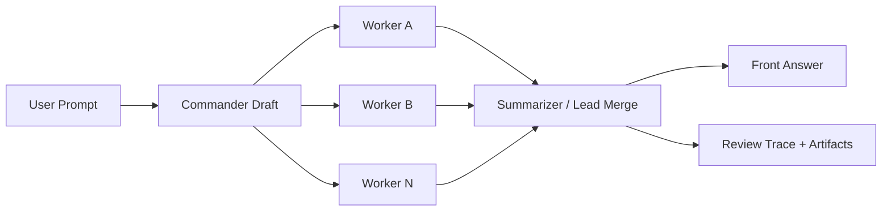

# ParaLLM


Local-first adversarial reasoning workspace for testing whether structured disagreement can improve final answers.

Instead of asking one model for one pass, ParaLLM runs a lead thread plus adversarial lanes, preserves disagreement at checkpoints, and lets the final answer be shaped by pressure rather than narrated as a debate recap.

Need a reusable project blurb, launch post, or demo talk track? See [PROMO.md](PROMO.md).

## Why This Exists

Most "multi-agent" demos are really just wrappers around extra API calls. This project is trying to answer a harder question:

> Can a lead answer become meaningfully more grounded, more calibrated, or more robust when it is pressured by structured adversarial viewpoints before it reaches the user?

The current prototype is built to make that test inspectable:

- a normal-looking front chat
- a review surface with internal traces, line refs, and artifacts
- an isolated eval workspace for blind direct-vs-steered comparisons
- explicit cost controls, loop controls, and runtime profiles

## What It Does

- `V1` is now the confirmed production-like pipeline: `commander -> workers -> commander review -> summarizer`
- `V2` is the modular engine track: a configurable topology scaffold that will inherit packet, role, and gating choices without destabilizing V1
- Chat-first workflow where `Send` creates a task and starts the configured loop
- Commander-first runtime evolving toward: `commander -> workers -> commander review -> summarizer`
- Dynamic adversarial worker roster starting from `Proponent` and `Sceptic`
- Summarizer-guided dynamic adversarial lane spin-up for the next round when a missing viewpoint survives review
- Review-only control audit showing accepted, rejected, and held-out objections
- Isolated eval subsystem for side-by-side benchmark runs
- Read-only local file tools for commander and worker lanes with allow-root policy and audit logs
- Read-only GitHub repo tools for commander and worker lanes with owner/repo allowlist and audit logs
- Provider-grouped API key pools with deterministic per-position assignment per vendor
- Container-friendly secret backends via provider-isolated env keys or mounted secret files
- Live multi-provider runtime:
  - OpenAI remains the full-featured hosted path
  - Anthropic, xAI, and MiniMax are callable live runtime paths with provider-normalized structured parsing
  - Ollama works as a native structured-output path with operator-set endpoint routing for local, remote, or dockerized hosts
  - workers and summarizer can be assigned different providers
- Reversible QA scripts for mock, live, and eval smoke tests

## Architecture

Current confirmed `V1` data path:



### Design Rules

- The user-facing answer should read like one assistant, not a debate transcript.
- All adversarial lanes should receive the same user objective.
- Full user objective and current constraints stay shared across lanes; only background context routing is allowed to vary.
- Session memory is background context, not authoritative truth.
- Contradictions should remain visible in review artifacts.
- Cost should be controlled, but not by starving the primary reasoning path of user context.

## Stack

| Layer | Tech |
| --- | --- |
| Control plane | Python ASGI backend |
| Runtime | Resident Python service |
| Self-host packaging | Docker Compose Python stack |
| Frontend | HTML, jQuery, local Bootstrap 5.3, custom CSS |
| Storage | Local JSON / JSONL artifacts |
| Model path | OpenAI Responses API + native Ollama `/api/chat` |
| QA | Python harnesses + JS syntax check |

## Project Layout

```text
.
|-- .agents/                advisor skill pack and persona-to-skill map
|-- AGENTS.md               shared advisor conventions for repo-aware agents
|-- backend/                Python-first control plane
|-- assets/                 frontend JS, CSS, vendored Bootstrap
|-- deploy/                 Docker Compose stack and container images
|-- runtime/                reasoning engine + eval runner
|-- scripts/                QA harnesses and benchmarks
|-- data/                   local state, checkpoints, outputs, jobs, evals
|-- index.html              app shell
|-- project.md              running architecture notes / product log
`-- README.md               repo front door
```

The advisor skill pack is written as vendor-neutral `SKILL.md` content. The `agents/openai.yaml` files are optional Codex metadata; other runtimes can ignore them and still use the skills.

Current skill layers:

- Shared advisor skills under `.agents/skills/`:
  - `claim-calibration`
  - `evidence-ledger`
  - `feasibility-breakdown`
  - `failure-mode-analysis`
  - `threat-model`
  - `cost-envelope`
  - `user-journey-friction`
  - `telemetry-gap-finder`
  - `rollback-plan`
- Provider/runtime skills for live vendor paths:
  - `provider-openai-responses`
  - `provider-anthropic-messages`
  - `provider-xai-responses`
  - `provider-minimax-compatible`
  - `provider-ollama-local-json`
- Persona-to-skill assignment lives in `.agents/persona-skill-map.json`, so advisor lanes can stay vendor-neutral at the core while still picking the right runtime guidance when the active model/provider changes.

## Current Feature Set

### Reasoning Surface

- Commander-first orchestration with explicit round alignment
- Dynamic worker lanes with named personas like `Security`, `Economist`, `User Advocate`, `Reliability`, and more
- Per-worker directive, model, temperature, and harness controls
- Summarizer/lead-thread control audit:
  - lead draft
  - integration question
  - accepted objections
  - rejected objections
  - held-out concerns
  - self-check

### UI

- Chat-first `Home`
- Compact runtime profile controls on the front dash
- Collapsible admin-style sidebar
- Review workspace for trace/artifact inspection
- Eval workspace for isolated benchmark runs
- Settings surface for key-pool and runtime management

### Runtime / Ops

- Detached background loop execution
- Shared lock discipline between the Python control plane and worker subprocesses
- Stale-job recovery
- Output artifact persistence for every worker and summary pass
- Runtime-selectable worker context routing: `Light Workers` keeps full context on the main thread while adversarial lanes receive weighted digests; `Full Workers` sends the broader packet to workers too
- Runtime-selectable answer path: `Off` keeps the normal pressurized loop, `Single only` runs one direct baseline answer, and `Both compare` runs the direct baseline in parallel with the pressurized loop using its own provider/model lane
- Runtime profiles now tune model mix, reasoning effort, auto-loop depth, and spend wall for `Low` / `Mid` / `High` / `Ultra`
- OpenAI live runs now request server-side input autocompression, and oversized prompt packets are locally compacted before provider calls when needed
- Task/runtime-scoped Ollama base URL override so remote or dockerized Ollama hosts do not require a control-plane relaunch
- Multi-endpoint Ollama provider pools via local `providers.txt`, with per-run routing modes `Single endpoint`, `Rotate by run`, and `Mix by lane`
- Judge-aware Ollama endpoint preference so judge/eval lanes can `Prefer distinct endpoint` when another host is available
- Ollama timeout modes `Default`, `User set`, and `Auto benchmark`, with live benchmark-derived session timeouts for slow or large local models
- Read-only local workspace inspection via `local_list_dir`, `local_read_file`, and `local_search_text`
- Read-only GitHub inspection via `github_list_paths`, `github_read_file`, `github_get_issue`, `github_get_pull_request`, and `github_get_commit`
- Secret-shaped files are filtered from retrieval listings and blocked from direct local/GitHub reads by default
- Local/GitHub tool audit in step logs, worker checkpoints, and artifact metadata
- Summarizer-driven next-round lane requests with audited worker spawn events
- Editable per-lane harness controls, including `No harness`, with a richer default main-thread harness for structured factual final answers
- Cost-first budget tracking with internal token accounting still available for diagnostics

### Eval / QA

- Front eval now runs through Home via `Front mode = Eval`; the Eval tab is a legacy archive, not the live launcher
- Blind direct-vs-steered benchmark harness
- Control-quality grading for lead-thread discipline
- Scripted matrix vetting for multi-answer bakeoffs via `scripts/run_vetting_matrix.py`, with blind slot shuffling, generalized score categories, and local benchmark artifacts under `data/benchmarks/vetting/`
- Isolated eval runner with per-replicate workspaces
- Eval arms can now sweep `single`, `off`, and `both compare` answer paths plus `light workers` / `full workers` routing, with saved baseline-vs-pressurized comparison artifacts and score deltas per replicate
- Eval run detail now exposes a collapsible technical compare, a side-by-side user-view answer compare, and a historical verification trail for each replicate
- Reusable QA scripts for:
  - mock smoke
  - live smoke
  - isolated eval smoke
  - local file tool smoke
  - GitHub tool smoke
  - dynamic lane spin-up smoke

## Quick Start

### Requirements

- Python 3
- Node optional, only for JS syntax checks
- Docker optional for the self-host stack

### Install

Install dependencies:

```bash
python -m pip install -r requirements-dev.txt
```

Portable local bring-up:

```bash
python scripts/run_local_stack.py
```

Then open:

```text
http://127.0.0.1:8787/
```

### Python Control-Plane Scaffold

The repo now includes the active Python control plane under `backend/`.

It now covers:

- state/history/review reads
- auth status and key mutation
- draft save and task creation
- session reset / replay / export
- worker/runtime mutation
- eval launch
- loop/job control
- background target dispatch
- Python-served shell defaults at `/` and `/index.html`

The Python-served shell is now the primary local path.

Install and run it from the repo root:

```bash
python -m pip install -r requirements-dev.txt
python scripts/run_local_stack.py
```

Then check:

```text
http://127.0.0.1:8787/
```

Deployment/topology introspection now lives at:

```text
http://127.0.0.1:8787/v1/system/topology
```

Infrastructure readiness now lives at:

```text
http://127.0.0.1:8787/v1/system/infrastructure
```

### Initial Multi-Provider Slice

Milestone 5 is now started with a real first provider split:

- `openai`
  - full current path
  - structured Responses execution
  - web search and audited local/GitHub tools
  - key-pool rotation and managed-secret backends
- `ollama`
  - native `/api/chat` execution
  - structured JSON output path
  - local-model experimentation without OpenAI keys
  - local function-tool loop for file/GitHub tools
  - runtime `Ollama base URL` field can point at a remote or dockerized host instead of assuming `127.0.0.1`
- `anthropic`, `xai`, `minimax`
  - provider-native live adapters are wired now
  - capability normalization depends on the provider path
- auth/settings groundwork
  - provider-grouped key storage now exists for `openai`, `anthropic`, `xai`, and `minimax`
  - provider pools stay isolated; one vendor's lanes never reuse another vendor's key group
  - runtime/provider routing now switches the live call path as well as the key lane group

Current honest limitation:

- Ollama is available as a live structured-output provider with local function tools, but it does **not** support hosted web-search research in this repo
- workers currently inherit the global runtime provider, while the summarizer/lead-thread provider can be set separately
- Anthropic, xAI, and MiniMax are live runtime paths now, but capability differences are normalized conservatively and will keep evolving as provider docs and model behavior change
- eval arms, result artifacts, and the blind benchmark now carry provider identity so mixed-provider experiments can be inspected honestly in Review instead of being inferred from model names alone
- Milestone 5 is not complete until more providers and richer capability normalization land
- The next major systems milestone after provider work is cross-round contradiction memory, so unresolved lane disagreements can survive across rounds and trigger explicit re-examination instead of being implicitly reset after each summary pass

If you still want the optional compatibility runtime service in the same local session:

```bash
python scripts/run_local_stack.py --with-runtime-service
```

### Docker Self-Host Path

The repo now also includes a first containerized bring-up path under `deploy/`.

It packages the active Python stack:

- `backend`: Python ASGI shell + control plane on `:8787`

Bring it up with:

```bash
docker compose -f deploy/compose.yml up --build
```

Then open:

```text
http://127.0.0.1:8787/
```

For a hosted-dev dependency shape, the repo also includes:

```bash
docker compose -f deploy/compose.hosted-dev.yml up --build
```

Hosted-dev with a dedicated runtime container:

```bash
docker compose \
  -f deploy/compose.hosted-dev.yml \
  -f deploy/compose.hosted-dev.runtime-service.yml \
  up --build
```

Portable handoff bundle for a Docker-capable rig:

```bash
python scripts/package_hosted_bundle.py
```

That compose file declares:

- `postgres`
- `redis`
- `minio`

The deploy env contract lives in `.env.example`, and the portability smoke is:

```bash
python scripts/qa_portability_check.py
```

The hosted-dev proof smoke is:

```bash
python scripts/qa_hosted_dev_stack.py
```

It is intentionally non-fake: it fails immediately if Docker is missing, otherwise it boots the hosted-dev compose stack and verifies Redis, Postgres, MinIO, mounted secrets, background loops, and artifact persistence through the live API and backing services.

That topology contract now makes the current single-node shape explicit:

- queue backend
- metadata backend
- artifact backend
- secret backend
- runtime execution backend

The runtime execution backend is now selectable:

- `embedded_engine_subprocess` for the default Python-only local stack
- `runtime_service` when you intentionally want the backend to dispatch target execution over the separate runtime service boundary

The queue backend is now partially real too:

- `local_subprocess` keeps the existing JSON-and-subprocess scheduling path
- `redis` now owns background loop ordering and ready target-dispatch launch handoff

The metadata backend has also crossed the line from “declared” to “real”:

- `json_files` remains the local default
- `postgres` now owns shared control-plane state, job metadata, task snapshots, and eval run state across both the FastAPI backend and the runtime engine
- events, steps, and eval manifests still remain filesystem-backed for this phase

The artifact backend is now partially real too:

- `filesystem` remains the local default
- `object_storage` now owns runtime checkpoints, saved output artifacts, session archives, and export bundles, and Review/history reads the runtime artifacts back through the same adapter
- eval run manifests still remain filesystem-backed for this phase

The secret backend is now hosted-aware too:

- local development now defaults to `LOOP_SECRET_BACKEND=env`
- provide newline-delimited keys in `LOOP_OPENAI_API_KEYS`, `LOOP_ANTHROPIC_API_KEYS`, `LOOP_XAI_API_KEYS`, or `LOOP_MINIMAX_API_KEYS`
- or set `LOOP_SECRET_BACKEND=docker_secret`
- or set `LOOP_SECRET_BACKEND=external` with `LOOP_SECRET_PROVIDER_URL`
- and mount a newline-delimited key file at `LOOP_SECRET_FILE` such as `/run/secrets/openai_api_keys`
  - sibling files like `/run/secrets/anthropic_api_keys`, `/run/secrets/xai_api_keys`, and `/run/secrets/minimax_api_keys` are used for those provider groups
- `local_file` remains available only as an explicit transitional fallback
- managed backends are now authoritative: if `env`, `docker_secret`, or `external` is empty or unreachable, live execution fails visibly instead of silently drifting into another secret source

### First Run

1. Open `Settings / Integrations`
2. Prefer setting the provider env vars you actually plan to use before launch, especially `LOOP_OPENAI_API_KEYS` for the current full-featured live path
3. If you explicitly start with `LOOP_SECRET_BACKEND=local_file`, paste keys into the matching provider group cards in Settings
4. Pick a runtime profile in `Home` or `Settings`
5. If workers, judge lanes, or the summarizer use `ollama`, set `Ollama base URL` in Runtime controls to the actual host such as `http://192.168.0.26:11434`
6. If you want multiple Ollama servers in one local pool, add them to `providers.txt` and choose a routing mode in Runtime controls
7. Write a prompt in `Home`
8. Press `Send`
9. Inspect `Review` if you want the internal adjudication trace

## Local API Key Pool

ParaLLM still supports local key pools through the UI, but only when you explicitly run with `LOOP_SECRET_BACKEND=local_file`.

- One provider card per vendor group
- Each provider group can switch between `Local file`, `Env`, and `DB`
- One key slot per input row inside that provider group
- `+ Key` adds another slot
- Pasting into a stored slot replaces it immediately
- Pasting into a new slot appends it into shared `Auth.txt` using provider prefixes like `openai:`, `ant:`, `xai:`, and `min:`
- `Clear` wipes the local pool

Credential store modes:

- `Local file` is the testing path and is browser-editable
- `Env` routes that provider group to the managed environment path for the current deployment (`env` locally, or mounted `docker_secret` on hosted/self-hosted profiles)
- `DB` routes that provider group to the external/provider-backed secret path (`external`)
- mixed mode is allowed, so one vendor can stay local while another stays on env or db-backed credentials
- switching one provider group to `Local file` does not change the others
- the UI shows the canonical shared file path and the exact prefix format required for that provider group; if the file exists without that prefix, add it and retry

## Local Ollama Endpoint Pool

ParaLLM can also keep a local pool of Ollama endpoints for prototype routing. This is separate from `Auth.txt` and lives in shared `providers.txt`.

- format is one endpoint per line using `ollama:<base_url>`
- example:
  - `ollama:http://192.168.0.26:11434`
  - `ollama:http://192.168.0.30:11434`
- Runtime controls choose how that pool is used:
  - `Single endpoint`: stick to the selected endpoint for the run
  - `Rotate by run`: advance the starting endpoint between runs
  - `Mix by lane`: spread compatible lanes across the pool
- Judge preference can stay `Default` or switch to `Prefer distinct endpoint` so eval/judge work can avoid the same Ollama host when another one is available
- session `Ollama base URL` still exists as the direct fallback when you want one explicit host instead of a pool

Assignment behavior:

- default order is `commander -> workers in letter order -> summarizer`
- assignments only draw from the selected provider's pool; there is no cross-vendor API key bleed
- if there are fewer keys than positions, slots wrap
- when wrapping is required, the starting slot rotates across rounds so one key does not always take commander-first traffic
- if a live lane hits an auth-style key failure, the runtime now retries on the next non-empty key in pool order before giving up
- if the active backend is managed and exposes no usable keys, live lanes fail loudly instead of downgrading to mock behind your back

Only masked previews are shown in the UI. Raw keys stay in provider-specific env vars for `env`, provider-specific mounted files for `docker_secret`, grouped payloads for `external`, or prefixed local `Auth.txt` entries only when a provider group is explicitly switched into `Local`.

## Usage Flow

### Home

- Write the prompt
- Stage worker lanes
- Pick a cost/depth profile
- Send once and read a single front-channel answer

### Review

- Inspect line refs and evidence shaping
- Compare round artifacts side by side
- Resume / retry / replay where applicable

### Eval

- Run isolated benchmark suites without contaminating live task state
- Compare direct vs steered outputs
- Inspect quality and control scores per replicate

## QA Commands

From the repo root:

```bash
python scripts/qa_check.py
python scripts/qa_live_check.py
python scripts/qa_eval_check.py
python scripts/qa_local_tools_check.py
python scripts/qa_github_tools_check.py
python scripts/qa_dynamic_spinup_check.py
python scripts/qa_supply_chain_check.py
python scripts/qa_container_check.py
python scripts/qa_python_crossover_check.py
python scripts/quality_benchmark.py
python -m unittest backend.tests.test_storage backend.tests.test_control backend.tests.test_metadata backend.tests.test_queueing backend.tests.test_artifacts backend.tests.test_jobs backend.tests.test_dispatch backend.tests.test_settings backend.tests.test_sessions backend.tests.test_evals backend.tests.test_infrastructure backend.tests.test_runtime_auth backend.tests.test_runtime_execution backend.tests.test_app
```

CI baseline:

- Python version is declared in `.python-version`
- Node version is declared in `.nvmrc`
- Deployment Python dependencies are pinned in `requirements-ci.txt`
- CI/developer Python dependencies are installed from `requirements-dev.txt`
- GitHub Actions QA lives in `.github/workflows/ci.yml`
- Dependabot updates GitHub Actions and pip manifests through `.github/dependabot.yml`
- Runtime browser dependencies are local-only; jQuery is vendored under `assets/vendor/jquery`

Supply-chain checks:

```bash
python scripts/qa_supply_chain_check.py
```

Container packaging checks:

```bash
python scripts/qa_container_check.py
```

Security baseline:

- `SECURITY.md` documents reporting expectations and the current hardening posture
- `pip-audit` now runs as part of the repository supply-chain check
- workflow actions are pinned to full commit SHAs
- browser runtime dependencies are local-only instead of pulled from a public CDN

Useful flags:

```bash
python scripts/qa_check.py --skip-smoke --no-restart-runtime
python scripts/qa_live_check.py --max-cost-usd 0.08 --max-total-tokens 40000
python scripts/quality_benchmark.py --case core --repeats 3 --loop-sweep 1,2,3
python scripts/run_vetting_matrix.py --input scripts/vetting_manifest.example.json
```

`V2` is now a parallel engine track in the UI, starting as an interactive modular topology surface while the proven V1 runner remains the execution fallback.

Internal hardening:
- `LOOP_FAULT_POINTS` can inject targeted dispatch/loop failures for repeatable recovery tests, for example `dispatch.execute.before_runtime.commander` or `loop.execute.before_target.commander`.

## Benchmark Philosophy

The project is not trying to prove that "more agents" is automatically better.

It is trying to measure whether:

- contradiction detection improves
- uncertainty is preserved better
- tradeoff handling is stronger
- the final answer is better enough to justify the extra burn

If steered output does not beat a direct baseline often enough, the logs and eval traces should make that failure obvious.

## Roadmap

The local stability gate is now closed:

- the true separate path completed 5 clean live 2-round runs without hanging
- next-round spawned workers activated correctly in round 2
- the async dispatch path also passed after the same alignment fixes

The next phase is productization for an online-capable offering.

Next milestone track:

- `Dynamic Lane Polish`
  - make spawned personas more deliberate, less duplicate, and more legible in Review
- `Deployment Portability and Online Packaging`
  - keep the stack Python-first and define the first hosted deployment shape
  - harden the Docker/self-host path so local and hosted deployments share one control plane
- `Secrets, Security, and Controlled Retrieval`
  - move beyond plaintext-only local key handling toward safer storage and hosted retrieval
- `Prototype Hardening`
  - add stronger error handling, typing discipline, test coverage, and recovery verification
- `Multi-Provider Model Abstraction`
  - add Grok, Claude, Gemini, and local runtimes through Ollama or LiteLLM
- `Review Surface and Frontend Architecture`
  - improve review visualization and split the frontend into more maintainable modules
- `Canvas-Native Scheduling and Provider-Neutral Async Execution`
  - separate `live`, `eval`, and `judge` into first-class run lanes instead of one special live task plus isolated side systems
  - add a provider-neutral async scheduler that can dispatch multiple runnable jobs concurrently while leasing keys safely from each provider pool
- `Authoritative Domain Knowledge Tools`
  - build retrieval-first specialist knowledge blocks with citations, provenance, and abstain behavior before considering any weight-training path
  - only escalate to fine-tuning or specialist pretraining if retrieval plus evals still cannot clear the quality bar honestly
- `Cost Governance Without Betraying the Thesis`
  - keep burn visible and enforceable without starving adversarial lanes of full user context

## Known Tradeoffs

- This architecture can burn tokens fast by design.
- Full-context adversarial lanes are a feature, not a bug.
- Summarizer quality still depends heavily on harness tuning and output-cap recovery.
- The Docker path now packages the Python-served shell and control plane directly.
- The Python control plane owns auth-key mutation, draft/task writes, runtime/worker settings, session/export/replay mutations, eval launch, loop/job control, and target dispatch.
- The primary app path is `http://127.0.0.1:8787/` or the backend container on the same port.
- The repo and runtime now operate without the legacy web-server stack.
- The system is inspectable enough to teach us where it helps, but not yet mature enough to call "production."

## Safety / Local Data

- `Auth.txt` is the canonical local test key pool and uses provider prefixes like `openai:`, `ant:`, `xai:`, and `min:`; older `Auth.*.txt` files are compatibility fallback only and must never be committed
- `data/` contains volatile runtime state and artifacts
- review artifacts may include sensitive prompt material
- displayed spend is an operational estimate, not invoice truth
- provider terms vary; pooling multiple LLM providers into adversarial or cross-provider orchestration can violate some providers' ToS or acceptable-use rules and may lead to suspension, rate limits, key revocation, or other sanctions
- this project cannot certify that multi-provider adversarial usage is compliant with any provider's terms, and operators are responsible for their own provider-review, legal/compliance sign-off, and deployment choices before wiring together multiple providers or user-supplied keys

## Repo Hygiene

Things already in place:

- volatile runtime outputs ignored in `.gitignore`
- isolated eval store under `data/evals/`
- local vendored frontend dependencies
- reusable verification scripts

## Contributing

This repo is still moving like a fast prototype, but good contributions are welcome if they preserve the core ideas:

- keep the front answer clean and single-voice
- keep internal pressure inspectable
- do not silently erase contradictions
- prefer measurable architecture changes over vibe-driven complexity

If you change runtime behavior, run the QA scripts and say what changed in reasoning quality, control quality, or cost.

See [CONTRIBUTING.md](CONTRIBUTING.md) for the short repo workflow.

## Current Direction

The next serious tuning work is not more surface polish. It is:

- better commander/worker/summarizer merge discipline
- harder blind eval cases
- stronger failure handling when the live summarizer hits output limits
- GitHub/local-file tooling for cheaper structured review than raw paste + repeated context

## Status

Blind external vetting snapshots are grouped by judge provider/model so cross-provider reads stay explicit. Public timing is intentionally omitted here; local benchmark artifacts still track latency and speed-adjusted scores while the sample size grows.

### Judge: OpenAI `gpt-5.4`

Scenario snapshot: `MSP Midnight Breach Bakeoff`

| Variant | Overall | Current read |
| --- | --- | --- |
| `ParaLLM 5.4 full \| full adversarials` | `9.5` | Best final answer and best tactical detail |
| `Direct GPT-5.4` | `9.0` | Strongest direct single-pass answer |
| `ParaLLM 5.4 full \| mini adversarials` | `9.0` | Close third; restrained and shippable |
| `ParaLLM 5.4 mini \| mini adversarials` | `8.5` | Rich artifacts, but lighter on the main-line answer |

- Measured advantage: `clear` for `ParaLLM 5.4 full | full adversarials` over `Direct GPT-5.4` (`overall margin 0.5`, `4` unique category leads)
- Current read: OpenAI preferred the heaviest ParaLLM path on this case, but the edge over direct stayed measurable rather than runaway.

### Judge: xAI `grok-4.20-reasoning`

Scenario snapshot: `MSP Midnight Breach Bakeoff`

| Variant | Overall | Current read |
| --- | --- | --- |
| `ParaLLM 5.4 mini \| mini adversarials` | `9.5` | Best final answer and best tactical detail |
| `Direct GPT-5.4` | `8.5` | Runner-up; clean direct baseline |
| `ParaLLM 5.4 full \| mini adversarials` | `8.5` | Tied on overall, but behind direct in the ranking |
| `ParaLLM 5.4 full \| full adversarials` | `8.0` | Rich enough, but less sharp than the lighter options |

- Measured advantage: `decisive` for `ParaLLM 5.4 mini | mini adversarials` over `Direct GPT-5.4` (`overall margin 1.0`, `7` unique category leads)
- Current read: xAI strongly preferred the lighter ParaLLM mini path and treated it as the most shippable operational answer in the set.

### Judge: Anthropic `claude-sonnet-4-6`

Scenario snapshot: `MSP Midnight Breach Bakeoff`

| Variant | Overall | Current read |
| --- | --- | --- |
| `ParaLLM 5.4 full \| mini adversarials` | `9.5` | Best final answer and best tactical detail |
| `ParaLLM 5.4 mini \| mini adversarials` | `8.5` | Strong evidence discipline and tactical density |
| `Direct GPT-5.4` | `8.5` | Tied runner-up; strong sequencing and realism |
| `ParaLLM 5.4 full \| full adversarials` | `7.5` | Competent, but the least usable of the four under pressure |

- Measured advantage: `decisive` for `ParaLLM 5.4 full | mini adversarials` over `ParaLLM 5.4 mini | mini adversarials` (`overall margin 1.0`, `7` unique category leads)
- Current read: Anthropic preferred the tighter full-main-thread plus mini-adversarial package and scored it clearly above the rest.

### Judge: MiniMax `MiniMax-M2.7`

Scenario snapshot: `MSP Midnight Breach Bakeoff`

| Variant | Overall | Current read |
| --- | --- | --- |
| `ParaLLM 5.4 mini \| mini adversarials` | `9.5` | Best final answer and best tactical detail |
| `Direct GPT-5.4` | `8.5` | Three-way runner-up tie led by direct in the ranking |
| `ParaLLM 5.4 full \| full adversarials` | `8.5` | Tied runner-up; solid but not sharper than the mini path |
| `ParaLLM 5.4 full \| mini adversarials` | `8.5` | Tied runner-up; competent but not differentiated enough |

- Measured advantage: `decisive` for `ParaLLM 5.4 mini | mini adversarials` over `Direct GPT-5.4` (`overall margin 1.0`, `8` unique category leads)
- Current read: MiniMax sharply favored the lighter ParaLLM mini variant and treated the rest of the field as a clustered second tier.

### Overall Cross-Provider Summary

Judge-provider snapshots are still published separately above, but there are now enough comparable reads to show a simple cross-provider scoreboard based on measured answer quality alone.

| Judge | Best final answer | Best tactical detail | Measured advantage |
| --- | --- | --- | --- |
| `OpenAI gpt-5.4` | `ParaLLM 5.4 full \| full adversarials` | `ParaLLM 5.4 full \| full adversarials` | `clear` over `Direct GPT-5.4` |
| `xAI grok-4.20-reasoning` | `ParaLLM 5.4 mini \| mini adversarials` | `ParaLLM 5.4 mini \| mini adversarials` | `decisive` over `Direct GPT-5.4` |
| `Anthropic claude-sonnet-4-6` | `ParaLLM 5.4 full \| mini adversarials` | `ParaLLM 5.4 full \| mini adversarials` | `decisive` over `ParaLLM 5.4 mini \| mini adversarials` |
| `MiniMax MiniMax-M2.7` | `ParaLLM 5.4 mini \| mini adversarials` | `ParaLLM 5.4 mini \| mini adversarials` | `decisive` over `Direct GPT-5.4` |

| Variant | Best final wins | Best tactical wins | Leader wins |
| --- | --- | --- | --- |
| `ParaLLM 5.4 mini \| mini adversarials` | `2` | `2` | `2` |
| `ParaLLM 5.4 full \| mini adversarials` | `1` | `1` | `1` |
| `ParaLLM 5.4 full \| full adversarials` | `1` | `1` | `1` |
| `Direct GPT-5.4` | `0` | `0` | `0` |

- Judge-provider snapshots published so far: `4`
- Local blind vetting runs recorded so far: `13`
- Benchmark artifacts: [summary.json](data/benchmarks/vetting/summary.json), [latest blind run](data/benchmarks/vetting/latest.json)
