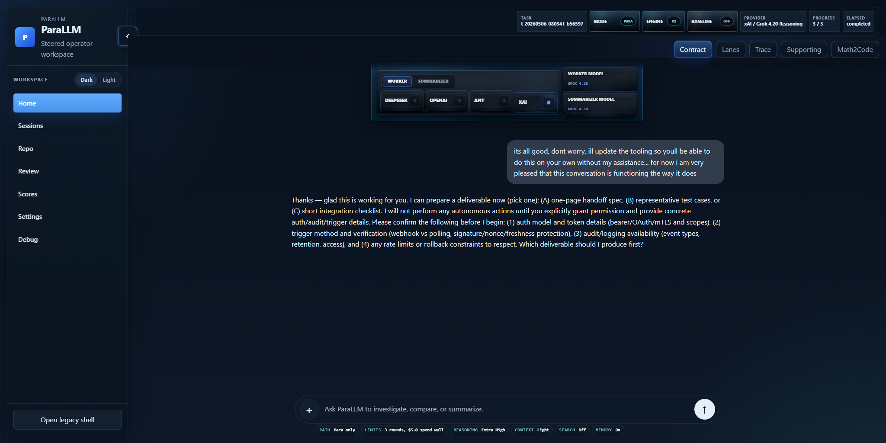
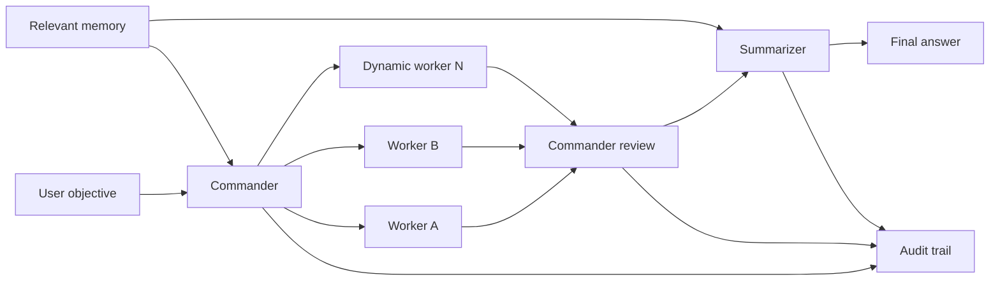

# ParaLLM


**Multi-lane reasoning, durable memory, and auditable model orchestration.**

ParaLLM turns a single request into a controlled reasoning process: a commander drafts, specialist lanes apply pressure, the commander reviews the objections, and a summarizer produces one coherent answer. The public Python edition is the completed research and reference implementation of that architecture.



## Why ParaLLM

Calling a model several times is easy. Making the calls share the same objective, preserve useful disagreement, use retained evidence, respect operational constraints, and leave an inspectable record is the actual work.

ParaLLM provides that control layer:

- V2 execution path: `commander -> workers -> commander review -> summarizer`
- Dynamic adversarial lanes that can be added when review exposes a missing viewpoint
- Per-lane provider, model, reasoning, context, harness, and tool controls
- Evidence-aware memory with provenance, temporal anchors, conflict locks, and explicit recall
- Direct, Direct + Memory, and Para execution modes for like-for-like comparison
- Provider torso covering OpenAI, Anthropic, xAI, DeepSeek, MiniMax, Kimi, and Ollama paths
- Local browser research, downloads, document extraction, workspace inspection, and audited tools
- Project-scoped agents, goals, supervision, and inter-agent message boards
- Human-readable provider-call ledgers, task traces, artifacts, timing, and evaluation records
- Flat, isometric, and spatial repository maps for human and machine inspection

## Execution Model


```mermaid
flowchart LR
    U[User objective] --> C[Commander]
    M[Relevant memory] --> C
    C --> W1[Worker A]
    C --> W2[Worker B]
    C --> WN[Dynamic worker N]
    W1 --> R[Commander review]
    W2 --> R
    WN --> R
    R --> S[Summarizer]
    M --> S
    S --> F[Final answer]
    C --> A[Audit trail]
    R --> A
    S --> A
```

The front answer stays single-voice. Disagreement, rejected shortcuts, memory use, tool activity, and provider payloads remain available in the review surfaces.

## Evaluation Snapshot

The headline MSP sweep used five severity-1 scenarios across three provider families, producing 15 completed cells per architecture. Scores are internal benchmark evidence, not independent certification.

| Architecture | Completed | Quality | Health | Control |
| --- | ---: | ---: | ---: | ---: |
| Pure Direct, prompt only | `15 / 15` | `8.01` | `7.86` | `n/a` |
| Direct + fractal memory | `15 / 15` | `8.49` | `8.64` | `n/a` |
| ParaLLM multi-lane | `15 / 15` | **`8.92`** | **`9.11`** | `7.80` |

Measured result: Para exceeded memory-backed Direct by `+0.43` quality and `+0.47` health, and prompt-only Direct by `+0.91` quality and `+1.26` health. Para's separate control score grades the internal orchestration trail, a surface that single-call Direct does not expose.

| Memory benchmark | Pure Direct | Direct + Memory | ParaLLM |
| --- | ---: | ---: | ---: |
| Synthetic Needle Ledger Transit | `0 / 3` | `3 / 3` | `3 / 3` |
| LongMemEval oracle pilot | `0 / 5` | `5 / 5` | `5 / 5` |

Read the methodology and limitations:

- [Direct vs Para memory-aware MSP sweep](docs/eval-results/2026-05-12-direct-vs-para-memory-sweep.md)
- [Pure Direct no-memory sweep](docs/eval-results/2026-05-12-pure-direct-no-memory-sweep.md)
- [Memory conflict owner-audit rerun](docs/eval-results/2026-05-12-memory-conflict-owner-audit-rerun.md)
- [Synthetic memory refresh](docs/eval-results/2026-05-19-synthetic-needle-ledger-codex-auth.md)
- [LongMemEval oracle pilot](docs/eval-results/2026-05-13-longmemeval-oracle-pilot.md)

## Quick Start

Requirements:

- Python 3.12 or a compatible newer release
- Provider credentials for hosted models, or an Ollama endpoint for the local-model path
- Node.js only for optional JavaScript checks

```bash
python -m pip install -r requirements-dev.txt
python scripts/run_local_stack.py
```

Open `http://127.0.0.1:8787/`.

Useful checks:

```bash
python scripts/qa_check.py
python scripts/qa_dynamic_spinup_check.py
python scripts/qa_provider_contract_parity.py
python scripts/qa_supply_chain_check.py
```

Credentials and generated runtime data belong in local configuration and ignored data paths. Do not commit provider keys, OAuth material, tenant exports, or private evaluation payloads.

## Repository Map

```text
backend/       Python control plane, tools, memory, agents, and API
runtime/       V2 orchestration and provider execution
assets/        Operator workspace and repository visualizations
contracts/     Provider, tool, and perception contracts
data/evals/    Evaluation arms and reusable suites
scripts/       QA, parity, benchmark, and local-start tooling
docs/          Architecture notes, evidence, and development history
```

Key reading:

- [Provider torso architecture](docs/provider-torso-architecture.md)
- [PERCSI and ParaLLM lineage](docs/percsi-parallm-lineage.md)
- [Backend operating notes](backend/README.md)
- [Full Python development-cycle README](docs/archive/README-python-development-cycle.md)

## Public Milestone

The Python development cycle is now closed as a feature-complete public reference milestone. This repository remains useful for study, experimentation, reproducible evaluation, and maintenance, but new product work is no longer developed in public by default.

### ParaLLM Native Enterprise

The private enterprise edition is a self-contained C17 evolution of the same architecture. Its direction includes owned local inference, model-package ingestion, SQLite-backed memory and audit state, multi-process agents, native research and document tooling, resource-aware lane scheduling, and platform adapters for workstation, server, and edge deployments.

The native edition is intended for organizations that need on-premises operation, tighter latency and resource control, inspectable model activity, private knowledge boundaries, or domain-specialized lane pools. It is not included in this public repository. Pilot, integration, and enterprise enquiries can be directed to the repository owner.

## Scope

ParaLLM is decision-support infrastructure. Evaluation results do not make it a certified compliance system or a replacement for accountable human approval in consequential workflows. The design goal is stronger reasoning with better evidence, controls, and auditability, not unbounded autonomous authority.
